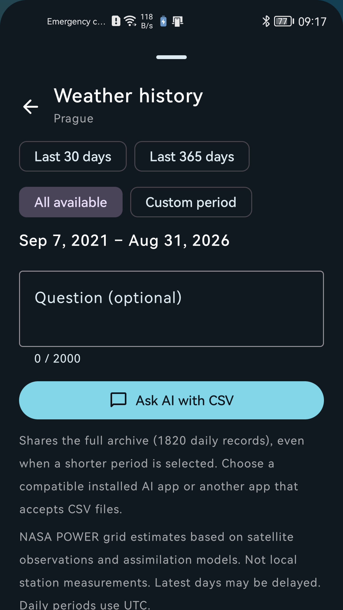

<p align="center">
  
</p>

<h1 align="center">Selia Weather</h1>

<p align="center">A focused worldwide Android weather app with regional model routing, observed radar, and an adaptive widget.</p>

<p align="center">
  <a href="https://github.com/Majkey25/Selia-Weather/actions/workflows/android.yml"></a>
  <a href="https://github.com/Majkey25/Selia-Weather/releases"></a>
  
  <a href="LICENSE"></a>
</p>

<p align="center">
  
  &nbsp;&nbsp;
  
  &nbsp;&nbsp;
  
  &nbsp;&nbsp;
  
</p>

## What it does

- Shows current and apparent temperature, dew point, wet-bulb temperature, precipitation, cloud layers, visibility, pressure, wind, sun, and Moon details.
- Adds UV, freezing-level, boundary-layer, atmospheric-water, instability, showers, and ground details.
- Shows worldwide observed precipitation through RainViewer for the available past two hours, with zoom, pan, animation, a timeline, and a radar-coverage mask. A separate sampled model map provides a 12-hour outlook where data are available; it is not future radar observation.
- Shows a horizontal 24-hour outlook, a 14-day forecast, and an hourly detail for each day. A complete day normally has 24 hours.
- Opens a five-year NASA POWER archive with 15 daily metrics. Select 30 days, 365 days, all data, or custom dates to calculate totals and coverage locally. After confirmation, Ask AI shares the full provenance-labelled CSV and your question with the compatible installed app you choose.
- Searches places worldwide, stores favourites, can use your optional current location, and can save an exact named point on an interactive world map or by coordinate.
- Uses nearby ČHMÚ stations in Czechia and METAR reports worldwide for available current measurements. Point-weather corrections require reports within 10 km and 30 minutes; nearby weather can still differ from the selected point. Ten-minute station totals do not replace model precipitation amounts or hourly forecasts.
- Preserves explicit drizzle reports, does not infer clear skies from sunshine duration, and distinguishes total cloud observations from partial-height airport reports. METAR observations never invent a precipitation amount.
- Keeps the last successful forecast for offline display.
- Includes a resizable launcher widget with per-widget colours, transparency, gradient or custom-image backgrounds, text scale, alignment, custom label, and selectable weather fields.
- Supports Metric and Imperial display units in the app and widgets.

## Forecast data and accuracy

The base forecast uses Open-Meteo Best Match worldwide. The app also requests verified provider-family series and calculates a robust median on the device when at least three values are available. Provider seamless series use local high-resolution grids inside their domains and global output elsewhere. Czech locations additionally request CHMI ALADIN. Suspended providers are excluded.

The app normally uses the diagnostic median or Best Match. Provider precipitation probability is preserved: agreement among deterministic models is not a calibrated probability. Learned weights require a validated production feed, individual model issue times and a matching regional holdout; the published feed is currently diagnostic. The research exporter rejects weights outside their evaluated region, season, or forecast lead. Weather details show the actual mode and contributors; no superior-accuracy claim is made.

The evidence and limits are recorded in [Global model routing](docs/research/global-model-routing.md), [Worldwide ensemble validation](docs/research/worldwide-ensemble-validation.md), and the [313-case temperature replay](docs/research/2026-09-05-temperature-replay.md). That replay improves pooled error over Best Match but contains station-level failures and is not a new holdout.

The [research workflow](research/README.md) can freeze future forecasts and later compare them with independent station observations. Missing truth stays unscored. [WeatherNext 3](docs/research/weathernext-3-review.md) is under review, not integrated; access and production-use permission remain prerequisites.

- [Open-Meteo Forecast API](https://open-meteo.com/en/docs)
- [NASA POWER Daily API](https://power.larc.nasa.gov/docs/services/api/temporal/daily/)
- [NASA POWER referencing guide](https://power.larc.nasa.gov/docs/referencing/)
- [AviationWeather worldwide METAR API](https://aviationweather.gov/data/api/)
- [NOAA ISD](https://www.ncei.noaa.gov/products/land-based-station/integrated-surface-database)
- [NASA GPM IMERG](https://gpm.nasa.gov/data/imerg)
- [RainViewer Weather Maps API](https://www.rainviewer.com/api/weather-maps-api.html)
- [ČHMÚ current station data](https://opendata.chmi.cz/meteorology/climate/now/)
- [ČHMÚ open weather data](https://opendata.chmi.cz/meteorology/weather/)

The historical data was obtained from the NASA Langley Research Center POWER project funded through the NASA Earth Science Division. CSV exports include the POWER Daily API version and access time. Selia Weather is not an official NASA, ČHMÚ, or Open-Meteo app.

## Language and requirements

Selia Weather supports Android 10 and later. It follows the Android system language by default. English is the fallback for unsupported system languages. You can select English, Czech, German, Spanish, or French in the app.

The public application ID is `com.majkeylab.weatheraladin`. A network connection is required for fresh forecasts, search, and radar. Build locally with JDK 17 and Android SDK 36.

## Widget

One stable widget layout adapts to compact, standard, wide, and tall sizes. Resize it horizontally or vertically. Each widget stores its own configuration, so two widgets can use different colours, fields, labels, and backgrounds.

Choose App style to use the forecast's weather-aware gradient, or start from Minimal, Material, Pixel, or Cupertino. Adjust fonts, text scale, alignment, corner shape, content spacing, colours, and background opacity independently.

Tap a colour swatch to open the HEX/RGB/opacity picker. Automatic text contrast handles opaque backgrounds; editing a text colour switches to manual control. Transparent or image backgrounds depend on your wallpaper and need a home-screen readability check.

Compact widgets prioritize a readable temperature. They can reduce displayed text size, hide secondary content, or reduce spacing when needed. Your saved choices remain available when you enlarge the widget.

For a custom background, the editor asks Android to grant access to the selected image. The widget keeps only the image URI. It decodes a bounded copy when it renders. If the URI becomes unavailable, the widget uses its configured colour background instead of failing.

## Support

The settings screen includes an optional [Buy Me a Coffee](https://www.buymeacoffee.com/majkey) link. It opens in Android's external browser. Support does not unlock features, give priority, or change the app.

## Monetisation status

Release builds do not contain or initialise Ads, UMP, Play Billing, Premium, or `AD_ID`. Debug-only QA builds keep optional test integrations outside the release dependency graph. Monetisation can return only after the app uses a commercially licensed forecast path and the public disclosures are updated.

## Build

```powershell
.\gradlew.bat :app:testDebugUnitTest :app:lintDebug :app:assembleDebug --console=plain
```

The debug APK is at `app/build/outputs/apk/debug/app-debug.apk`.

To publish documentation when an upstream forecast fails validation, run `gh workflow run forecast-data.yml --ref main -f include_forecasts=false`. This manual mode publishes an empty diagnostic feed alongside the privacy page. Default forecast runs still require valid data; this does not enable production calibration.

## Privacy

The app has no developer account or separate analytics SDK. It keeps the selected place, favourites, widget settings, forecast cache, and a bounded history cache in internal app storage. Current location is optional. Forecast coordinates are sent to Open-Meteo. A bounded coordinate box is sent to AviationWeather to find nearby METAR reports, including in Czechia. The observed map loads visible OpenStreetMap and RainViewer tiles. After you select **Weather history** or **Load archive**, the selected coordinates are sent to NASA POWER when the archive needs a refresh. A history CSV leaves the app only after you select **Ask AI with CSV** and choose a recipient in Android's share sheet. In Czechia, the app selects nearby ČHMÚ station IDs locally and requests their public observation files without sending the selected coordinates to ČHMÚ. Read the [privacy policy](https://majkey25.github.io/Selia-Weather/).

## Status

The app uses the product identity Selia Weather and the short launcher label Weather. It keeps the public package `com.majkeylab.weatheraladin`, so existing Play installations update normally. GitHub prereleases are for testing. Published calibration remains diagnostic until its source, provenance and holdout checks pass. Google Play uses a separate private upload key and Play App Signing.

## Legal information

Developer and privacy contact: Matěj Teplý (Majkey25), [majkeylab@gmail.com](mailto:majkeylab@gmail.com).

- [Privacy policy](https://majkey25.github.io/Selia-Weather/)
- [Terms of use](https://majkey25.github.io/Selia-Weather/terms.html)
- [Payments and refunds](https://majkey25.github.io/Selia-Weather/refunds.html)
- [Cookies and storage](https://majkey25.github.io/Selia-Weather/cookies.html)

The legal pages use local assets, keyboard navigation and visible focus indicators, with no tracking scripts or consent banner for nonexistent cookies. [Review evidence and unresolved requirements](docs/legal-audit-2026-09-08.md) distinguish implemented disclosures from legal and accessibility certification; no global compliance claim is made.

## License

Source code is available under the [MIT License](LICENSE). Weather data and radar remain subject to their providers' terms.
