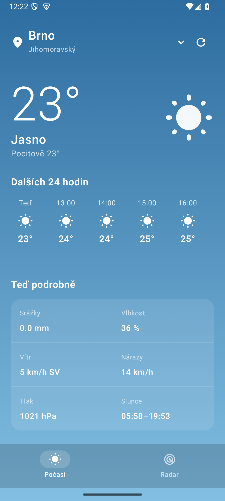
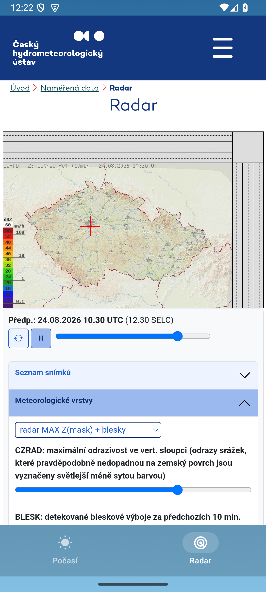
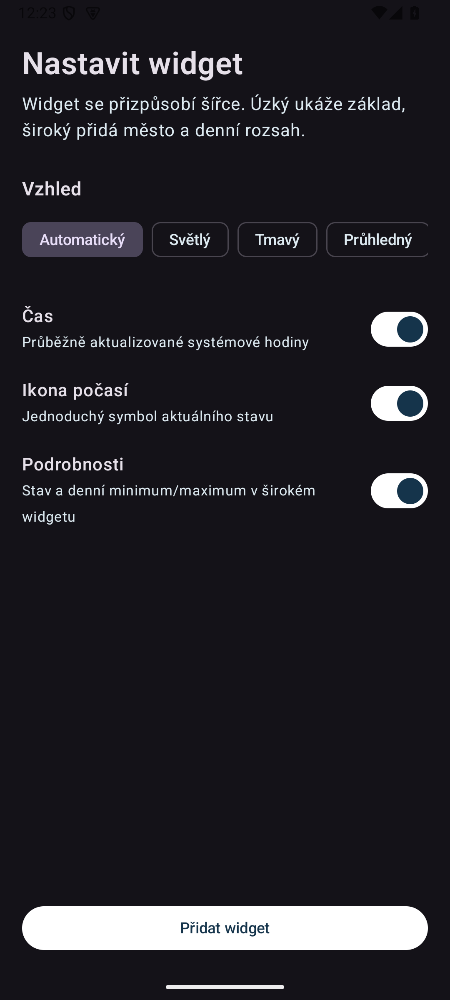

<p align="center">
  
</p>

<h1 align="center">Počasí Česko</h1>

<p align="center">Čistá Android předpověď pro česká města. ALADIN, 14 dní, radar ČHMÚ a resizovatelný widget.</p>

<p align="center">
  <a href="https://github.com/Majkey25/Pocasi-Cesko/actions/workflows/android.yml"></a>
  <a href="https://github.com/Majkey25/Pocasi-Cesko/releases"></a>
  
  <a href="LICENSE"></a>
</p>

<p align="center">
  
  &nbsp;&nbsp;
  
  &nbsp;&nbsp;
  
</p>

## Co aplikace umí

- aktuální stav, pocitovou teplotu, srážky, vlhkost, vítr, tlak a časy slunce;
- přehled dalších 24 hodin a 14denní předpověď;
- hledání omezené na města a obce v Česku;
- oficiální interaktivní radar a nowcasting ČHMÚ;
- offline zobrazení poslední úspěšné předpovědi;
- resizovatelný widget s časem a počasím;
- automatický, světlý, tmavý a průhledný vzhled widgetu;
- žádný účet, reklamy ani API klíč.

## Přesnost a zdroje

První tři dny používají `chmi_aladin_seamless`. V Česku jde o hodinovou předpověď modelu ALADIN CZ s rozlišením 1 km a aktualizací každých 6 hodin. Open-Meteo pak naváže ECMWF IFS HRES 9 km, aby výhled pokryl 14 dní. Dlouhodobější část má přirozeně vyšší nejistotu.

- [Open-Meteo CHMI Forecast API](https://open-meteo.com/en/docs/chmi-api)
- [Otevřená data ČHMÚ](https://opendata.chmi.cz/meteorology/weather/)
- [Radar ČHMÚ](https://produkty.chmi.cz/radar/)

Projekt není oficiální aplikací ČHMÚ ani Open-Meteo. Data zůstávají označená svým zdrojem.

## Widget

Widget mění obsah podle dostupné šířky. Úzká varianta ukazuje čas, ikonu a teplotu. Široká přidá město, stav a denní minimum/maximum. Konfigurace umožní skrýt čas, ikonu nebo podrobnosti a zvolit vzhled. Počasí se aktualizuje přibližně každých 30 minut podle pravidel Android launcheru.

## Požadavky

- Android 13 nebo novější;
- připojení k internetu pro nové počasí, hledání a radar;
- JDK 17 + Android SDK 36 pro lokální build.

## Build

```powershell
.\gradlew.bat :app:testDebugUnitTest :app:lintDebug :app:assembleDebug --console=plain
```

APK vznikne v `app/build/outputs/apk/debug/app-debug.apk`.

## Soukromí

Aplikace nepoužívá analytiku, účet ani reklamní SDK. Poslední vybrané město, nastavení widgetu a cache počasí zůstávají v interním úložišti aplikace. Síťové požadavky směřují pouze na Open-Meteo a ČHMÚ. Podrobnosti jsou v [PRIVACY.md](PRIVACY.md).

## Stav

`v0.1.0-beta.1` je první veřejná beta. Release APK používá vývojový podpis a slouží k testování mimo obchod. Produkční distribuce vyžaduje stabilní neveřejný signing key.

## Licence

Zdrojový kód je dostupný pod [MIT License](LICENSE). Data a radar se řídí podmínkami svých poskytovatelů.
