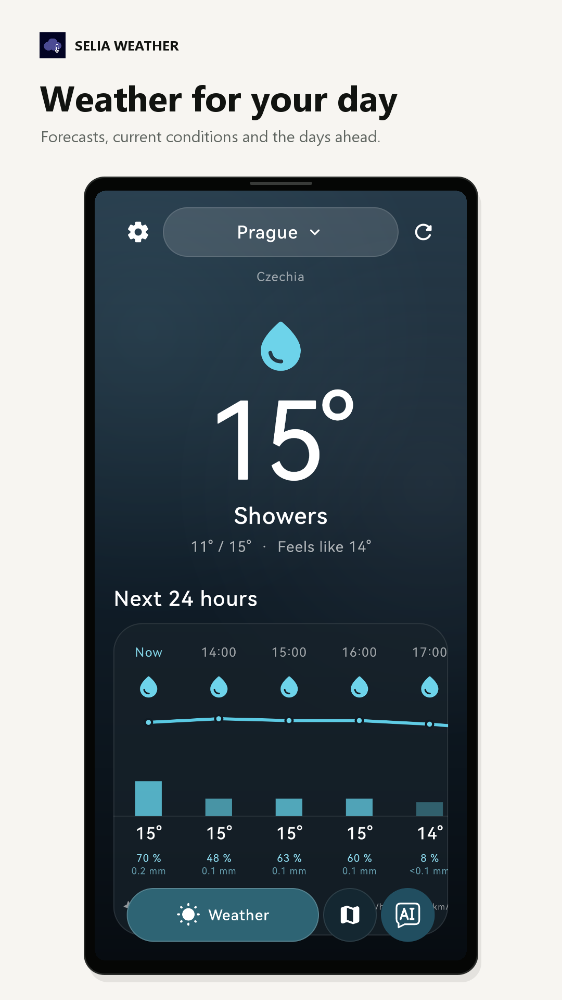
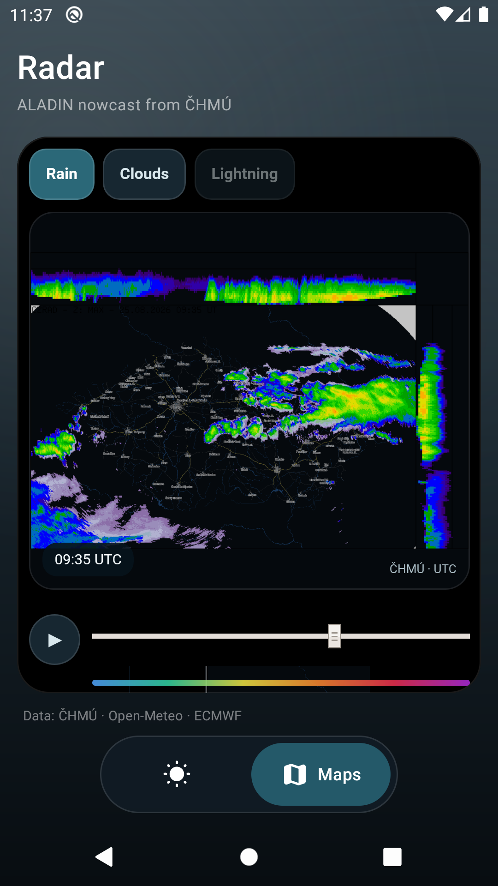
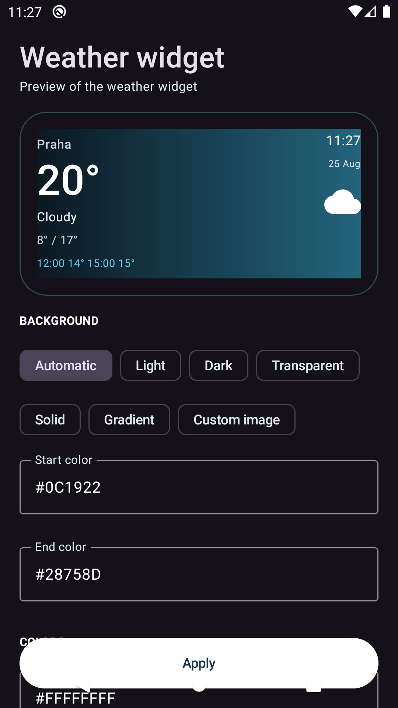

<p align="center">
  
</p>

<h1 align="center">Selia Vetra</h1>

<p align="center">A focused worldwide Android weather app with extra ČHMÚ observations and radar in Czechia, plus an adaptive widget.</p>

<p align="center">
  <a href="https://github.com/Majkey25/Selia-Weather/actions/workflows/android.yml"></a>
  <a href="https://github.com/Majkey25/Selia-Weather/releases"></a>
  
  <a href="LICENSE"></a>
</p>

<p align="center">
  
  &nbsp;&nbsp;
  
  &nbsp;&nbsp;
  
</p>

## What it does

- Shows current and apparent temperature, dew point, wet-bulb temperature, precipitation, cloud layers, visibility, pressure, wind, sun, and Moon details.
- Adds UV, freezing-level, boundary-layer, atmospheric-water, instability, showers, and ground details.
- Shows an on-demand 5 by 5 Local rain field for the next 24 hours. It samples 25 nearby forecast points inside a 20 km radius and is not observed radar.
- Shows a horizontal 24-hour outlook, a 14-day forecast, and an hourly detail for each day. A complete day normally has 24 hours.
- Loads a bounded 365-day NASA POWER archive on demand, calculates rainfall and climate summaries locally, shows every daily row, and exports one provenance-labelled CSV through Android's share sheet for analysis in ChatGPT or another app.
- Searches places worldwide, stores favourites, can use your optional current location, and can save an exact named point on an interactive world map or by coordinate.
- Includes ČHMÚ rain radar, satellite clouds, nowcast, and lightning. Rain and clouds are base layers. Lightning is an independent overlay on either layer.
- In Czechia, corrects current temperature, humidity, wind, precipitation, and sky condition from up to three nearby ČHMÚ automatic stations when their observations are fresh.
- Keeps the last successful forecast for offline display.
- Includes a resizable launcher widget with per-widget colours, transparency, gradient or custom-image backgrounds, text scale, alignment, custom label, and selectable weather fields.
- Supports Metric and Imperial display units in the app and widgets.
- The free build can show an occasional fullscreen interstitial after a completed map visit. Google UMP controls consent. Either Premium purchase removes ads.

## Forecast data and accuracy

The base forecast uses Open-Meteo Best Match worldwide, which selects the highest-resolution applicable model for the requested coordinates and returns the location's local timezone. Current unreleased builds also request explicit global provider series and calculate a robust median on the device when at least three values are available. Czech locations add CHMI ALADIN and apply fresh nearby ČHMÚ station observations after that calculation. The prototype falls back to Best Match and is not presented as calibrated or more accurate until a locked holdout supports that claim.

- [Open-Meteo Forecast API](https://open-meteo.com/en/docs)
- [NASA POWER Daily API](https://power.larc.nasa.gov/docs/services/api/temporal/daily/)
- [NASA POWER referencing guide](https://power.larc.nasa.gov/docs/referencing/)
- [ČHMÚ current station data](https://opendata.chmi.cz/meteorology/climate/now/)
- [ČHMÚ open weather data](https://opendata.chmi.cz/meteorology/weather/)
- [ČHMÚ radar](https://produkty.chmi.cz/radar/)
- [ČHMÚ satellite data](https://opendata.chmi.cz/meteorology/weather/satellite/geo/vis-ir/)

The historical data was obtained from the NASA Langley Research Center POWER project funded through the NASA Earth Science Division. CSV exports include the POWER Daily API version and access time. Selia Vetra is not an official NASA, ČHMÚ, or Open-Meteo app.

## Language and requirements

Selia Vetra supports Android 10 and later. It follows the Android system language by default. English is the fallback for unsupported system languages. You can select English, Czech, German, Spanish, or French in the app.

The public application ID is `com.majkeylab.weatheraladin`. A network connection is required for fresh forecasts, search, and radar. Build locally with JDK 17 and Android SDK 36.

## Widget

One stable widget layout adapts to compact, standard, wide, and tall sizes. Resize it horizontally or vertically. Each widget stores its own configuration, so two widgets can use different colours, fields, labels, and backgrounds.

For a custom background, the editor asks Android to grant access to the selected image. The widget keeps only the image URI. It decodes a bounded copy when it renders. If the URI becomes unavailable, the widget uses its configured colour background instead of failing.

## Support

The settings screen includes an optional [Buy Me a Coffee](https://www.buymeacoffee.com/majkey) link. It opens in Android's external browser. Support does not unlock features, give priority, or change the app.

## Ads and Premium

Google Play offers `remove_ads_lifetime` as a one-time purchase and `premium_monthly` as an auto-renewing subscription. Either option removes ads. The app checks active purchases whenever Play Billing connects or the app resumes. A pending or unknown entitlement never enables ads.

The debug build uses Google's published test ad IDs. Production ad IDs are supplied as Gradle properties `ALADIN_ADMOB_APP_ID` and `ALADIN_INTERSTITIAL_AD_UNIT_ID`. A release built without both stays ad-disabled.

## Build

```powershell
.\gradlew.bat :app:testDebugUnitTest :app:lintDebug :app:assembleDebug --console=plain
```

The debug APK is at `app/build/outputs/apk/debug/app-debug.apk`.

## Privacy

The app has no developer account or separate analytics SDK. It keeps the selected place, favourites, widget settings, forecast cache, and a bounded history cache in internal app storage. Current location is optional. Forecast coordinates are sent to Open-Meteo. After you select **Load archive**, the selected coordinates are sent to NASA POWER. A history CSV leaves the app only after you select **Ask ChatGPT** and choose a recipient in Android's share sheet. The worldwide point picker loads visible OpenStreetMap tiles only while open. In Czechia, the app selects nearby ČHMÚ station IDs locally and requests their public observation files without sending the selected coordinates to ČHMÚ. The free build uses Google Mobile Ads and UMP. Purchases use Google Play Billing. Read the [privacy policy](https://majkey25.github.io/Selia-Weather/).

## Status

The app uses the product identity Selia Vetra and the short launcher label Vetra. It keeps the public package `com.majkeylab.weatheraladin`, so existing Play installations update normally. GitHub prereleases are for testing. The published six-model feed remains diagnostic until calibration passes; the consensus prototype is not an accuracy claim. Google Play uses a separate private upload key and Play App Signing.

## License

Source code is available under the [MIT License](LICENSE). Weather data and radar remain subject to their providers' terms.
